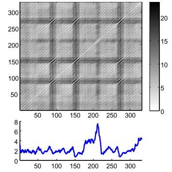

```{r setup, include = FALSE}
knitr::opts_chunk$set(
  collapse = TRUE,
  comment = "#>"
)
```

Recently I began to look further into Time Series(TS). During the course of my Master's degree, I used the [forecast](https://CRAN.R-project.org/package=forecast) package quite a bit (Thanks to Prof. Hyndman), and TS got my attention. So, after reading lots of publications about everything you can imagine about TS, I came across one publication from Prof. Eamonn, of the University of California, that made me contact him to ask a few questions. After receiving a huge amount of information from him, one particular subject caught my attention: Matrix Profile. I was so much impressed that I started to write the [TSMP R Package](https://franzbischoff.github.io/tsmp/).

Enough talking, so what is a Matrix Profile? Why should you care about it?

## Matrix Profile

If you are here, you are likely aware of what a Distance Matrix (DM) is. If not, think about those tables that used to be on maps with the distance between cities. It is widely used in TS for clustering, classification, motif search etc. But, even for modestly sized datasets, the algorithms can take months to compute it and even with speed-up techniques (i.e., indexing, lower-bounding, early abandoning) they can be, at best, one or two orders of magnitude faster.

Matrix Profile it's like a DM but faster (much faster) to compute. _Figure 1_ shows a DM and a Matrix Profile. As you can see, in the Matrix Profile, as the name suggests, you see the Profile of a DM. It stores the minimum Euclidean distance of every subset of one TS (think of a Sliding Window) with another (or itself, called Self-Join). It also stores a companion vector called Profile Index, that gives us the index of each nearest neighbor.

```{r Figure 1, echo=FALSE, fig.cap="Figure 1: Distance Matrix and its Matrix Profile.", out.width=350, out.height=350, message=FALSE, warning=FALSE}

```

And is this good?

## Why should you care?

DM usually stores redundant information, useless for most TS applications. The Matrix Profile has a host of interesting and exploitable properties. For example, the highest point on the Matrix Profile corresponds to the TS discord, the (tied) lowest points correspond to the locations of the best TS motif pair, and the variance can be seen as a measure of the TS complexity. Moreover, the histogram of the values in the Matrix Profile is the exact answer to the TS density estimation. Particularly, it has implications for TS motif discovery, TS joins, shapelet discovery (classification), density estimation, semantic segmentation, visualization, rule discovery, clustering etc.^[For pure [similarity search](https://en.wikipedia.org/wiki/Similarity_search), it is suggested you see [MASS](http://www.cs.unm.edu/~mueen/FastestSimilaritySearch.html) for Euclidean Distance, and the [UCR Suite](http://www.cs.ucr.edu/~eamonn/UCRsuite.html) for DTW]

This method has the following advantages/features:

- It is **exact**, providing no false positives or false dismissals.
- It is **simple** and parameter-free. In contrast, the more general metric space APSS^[All Pairs Similarity Search] algorithms require building and tuning spatial access methods and/or hash functions.
- It requires an inconsequential space overhead, just O(_n_) with a small constant factor.
- It is extremely **scalable**, and for _extremely large_ datasets we can compute the results in an anytime fashion, allowing ultra-fast _approximate_ solutions.
- Having computed the similarity join for a dataset, we can incrementally update it very efficiently. In many domains, this means we can effectively maintain exact joins on **streaming data** forever.
- It provides _full joins_, eliminating the need to specify a similarity _threshold_, which is a near impossible task in this domain.
- It is embarrassingly **parallelizable**, both on multicore processors and in distributed systems.


### Performance on an Intel(R) Core(TM) i7-7700 CPU @ 3.60GHz using a random walk dataset

```{r eval=FALSE, include=TRUE}
set.seed(2018)
data <- cumsum(sample(c(-1, 1), 40000, TRUE))
```

```{r table1, echo=FALSE, message=FALSE, warnings=FALSE, results='asis'}
tabl <- "
|  | Elapsed Time^[These are results using only R code, no low-level C code optimizations] | Data size | Window size | Threads |
|-----------|:------------:|:---------:|:-----------:|:-------:|
| `scrimp()` | 45.30s | 40000 | 1000 | 1 |
| `stomp_par()` | 52.72s | 40000 | 1000 | 8 |
| `stomp()` | 136.01s | 40000 | 1000 | 1 |
| `stamp_par()` | 140.25s | 40000 | 1000 | 8 |
| `stamp()` | 262.03s | 40000 | 1000 | 1 |
"
cat(tabl) # output the table in a format good for HTML/PDF/docx conversion
```


## Further readings

All information you need to get started with Matrix Profiles is available at the [UCR Matrix Profile](http://www.cs.ucr.edu/~eamonn/MatrixProfile.html) webpage. Papers, Slides, examples, are available there.

Once become more familiar with this concept, you can start reading the [TSMP R Package](https://franzbischoff.github.io/tsmp/) documentation.

